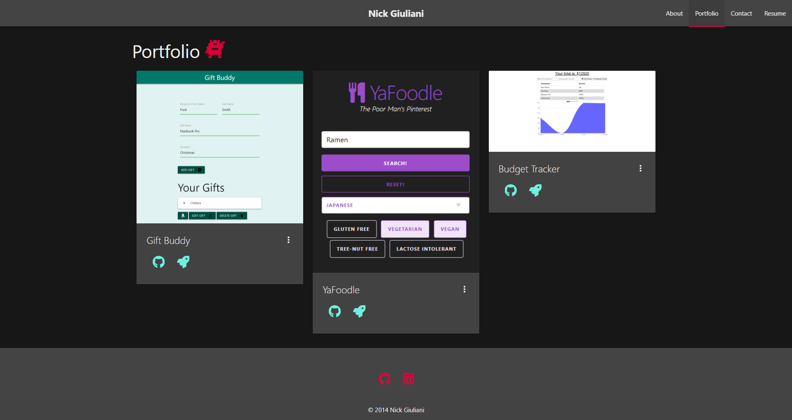

# React Portfolio 

## Description 

This project is a personal Web Developer portfolio of mine using the React Library and the Materialize CSS framework.  Each section of my portfolio is broken up into their own component and rendered on a single page, one at a time.  Using SPA's (Single Page Applications) creates a more performant and scalable application, which works well for both the user and the developer.  

 
## Usage 

To view my portfolio, visit this link: http://thereeling.github.io/react-portfolio

## Credits 

* Materialize CSS https://materializecss.com/
* Styled Components https://styled-components.com/
* React https://reactjs.org/